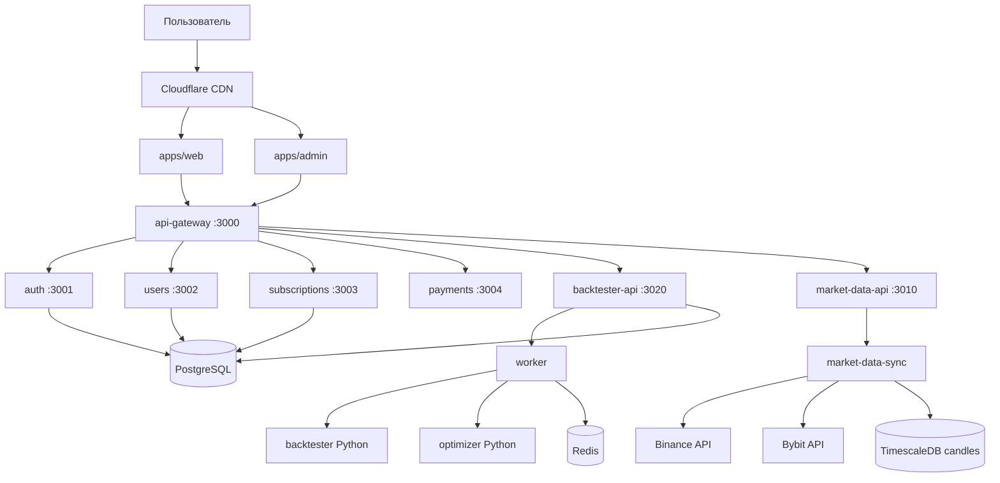
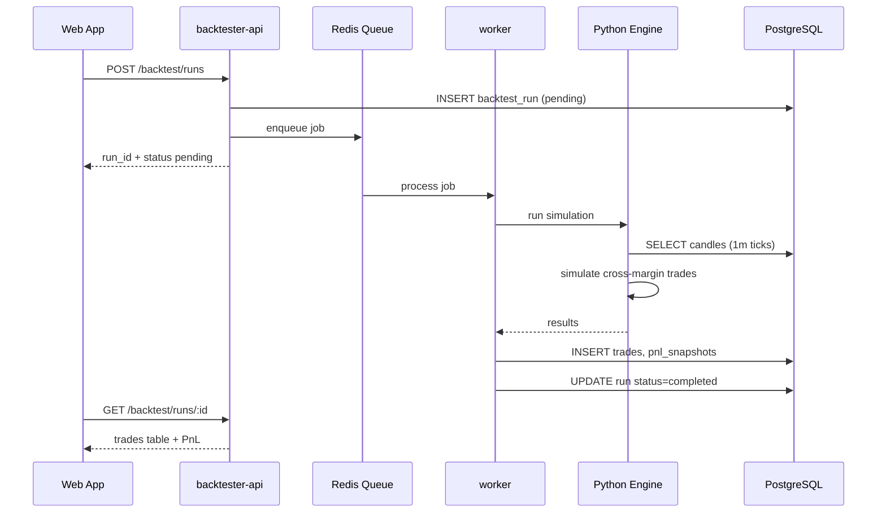

# ARCHITECTURE — ReboundLab

## Обзор системы

## Сервисы

| Сервис | Язык | Назначение |
|--------|------|------------|
| api-gateway | TypeScript/NestJS | Единая точка входа, rate limit |
| auth | TypeScript | JWT, регистрация, логин |
| users | TypeScript | Профили, настройки |
| subscriptions | TypeScript | Планы, trial, feature gates |
| payments | TypeScript | ЮKassa webhooks |
| referrals | TypeScript | Реферальные коды |
| market-data-api | TypeScript | Read-only: symbols, candles |
| market-data-sync | Python | Загрузка и sync с бирж |
| backtester-api | TypeScript | Запуск/статус backtest runs |
| backtester-engine | Python | CPU-intensive расчёты |
| optimizer | Python | Automatic mode |
| worker | TypeScript | BullMQ job processor |
| notifications | TypeScript | Email |

## Поток бэктеста

## Кросс-маржа (multi-coin)

- Один общий `bank_balance` на все открытые позиции
- Каждая позиция: `entry_pct_of_current_bank`
- Ликвидация любой позиции при кросс-марже → `bank_balance = 0`
- Все сделки останавливаются
- Записывается: `liquidated_symbol`, `liquidated_at`
- UI: кнопка «Исключить монету и пересчитать»

## Automatic optimizer

1. Grid search параметров (entry%, leverage, avg×3, Y/Z/N)
2. Прогон на выбранных USDT-парах
3. Если ликвидация → исключить монету → повторить
4. Вернуть лучший набор + сравнение «до/после исключения»

## Масштабирование

| Фаза | Users | Инфра |
|------|-------|-------|
| MVP | 0–1K | 1 VPS, Docker Compose |
| Growth | 1K–10K | 2× API, managed DB |
| Scale | 10K–100K | Kubernetes, dedicated MD node |

## 2D-офис (только Cursor)

Не входит в production stack для пользователей.
Метафора для владельца: переключение между агентами (код, оплаты, реклама, сайт).
