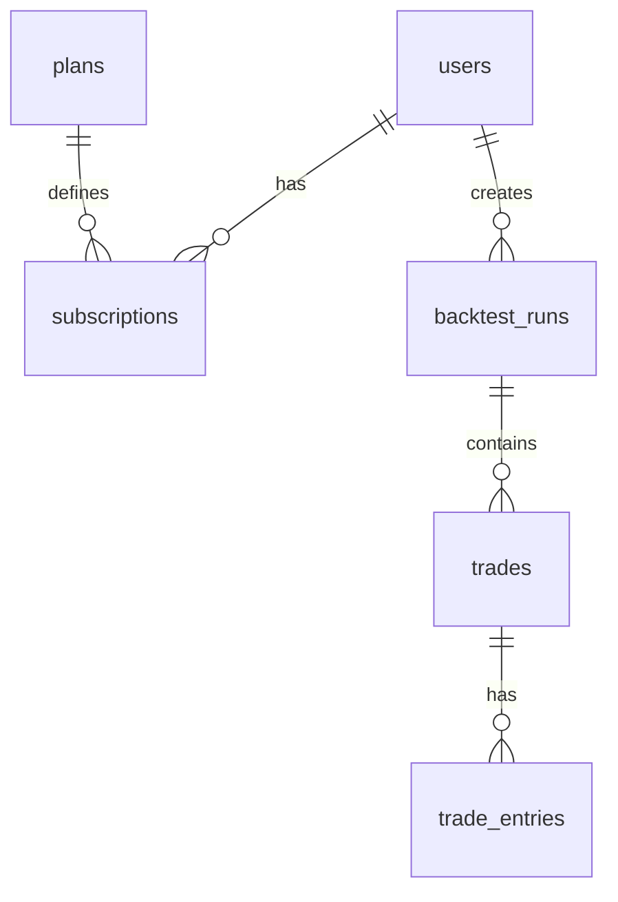

# DATABASE — ReboundLab

## Обзор

Один кластер PostgreSQL 16 + TimescaleDB extension.

| Схема | Назначение |
|-------|------------|
| `core` | users, subscriptions, payments |
| `market` | exchanges, pairs, candles, sync |
| `backtest` | runs, trades, optimization |

## ER-диаграмма (core)

## Таблицы core

### users
| Column | Type | Notes |
|--------|------|-------|
| id | UUID PK | |
| email | VARCHAR UK | |
| password_hash | VARCHAR | bcrypt |
| status | ENUM | active, banned, deleted |
| created_at | TIMESTAMPTZ | |

### plans
| Column | Type | Notes |
|--------|------|-------|
| id | UUID PK | |
| tier | ENUM | trial, starter, pro, automatic |
| features | JSONB | feature flags |
| price_rub | DECIMAL | |
| trial_runs | INT | default 10 |

### subscriptions
| Column | Type | Notes |
|--------|------|-------|
| id | UUID PK | |
| user_id | UUID FK | |
| plan_id | UUID FK | |
| status | ENUM | active, expired, cancelled |
| runs_used | INT | |
| expires_at | TIMESTAMPTZ | |

## Таблицы market

### exchanges
| Column | Type |
|--------|------|
| id | UUID PK |
| code | VARCHAR UK | binance, bybit |
| name | VARCHAR |
| api_base_url | VARCHAR |

### trading_pairs
| Column | Type | Notes |
|--------|------|-------|
| id | UUID PK | |
| exchange_id | UUID FK | |
| symbol | VARCHAR UK | BTCUSDT |
| base_asset | VARCHAR | BTC |
| quote_asset | VARCHAR | USDT |
| is_active | BOOLEAN | |
| history_from | DATE | earliest available |
| min_history_days | INT | ≥365 to include |

### candles (TimescaleDB hypertable)
| Column | Type | Notes |
|--------|------|-------|
| pair_id | UUID | part of PK |
| timeframe | ENUM | 1m, 5m, 15m, 1h, 4h, 1d |
| open_time | TIMESTAMPTZ | part of PK |
| open, high, low, close | DECIMAL | |
| volume | DECIMAL | |

**Индекс:** `(pair_id, timeframe, open_time DESC)`
**Compression:** данные старше 90 дней
**Partition:** по `open_time` (TimescaleDB chunks)

### sync_state
| Column | Type | Notes |
|--------|------|-------|
| pair_id | UUID | |
| timeframe | ENUM | |
| last_candle_time | TIMESTAMPTZ | |
| last_sync_at | TIMESTAMPTZ | |

## Таблицы backtest

### backtest_runs
| Column | Type | Notes |
|--------|------|-------|
| id | UUID PK | |
| user_id | UUID FK | |
| strategy_params | JSONB | all input params |
| range_start, range_end | DATE | |
| status | ENUM | pending, running, completed, failed |
| initial_deposit | DECIMAL | |
| final_balance | DECIMAL | |
| final_pnl_pct | DECIMAL | |
| liquidated | BOOLEAN | |
| liquidated_symbol | VARCHAR | nullable |
| liquidated_at | TIMESTAMPTZ | nullable |

### trades
| Column | Type | Notes |
|--------|------|-------|
| id | UUID PK | |
| run_id | UUID FK | |
| symbol | VARCHAR | |
| opened_at, closed_at | TIMESTAMPTZ | |
| entry_pct_of_deposit | DECIMAL | |
| avg_count | INT | 0–3 |
| avg_details | JSONB | each avg: pct, price, liq_price |
| leverage | DECIMAL | |
| pnl_usd, pnl_pct | DECIMAL | |
| liq_price | DECIMAL | current at close |
| status | ENUM | open, closed, liquidated |

### optimization_runs
| Column | Type | Notes |
|--------|------|-------|
| id | UUID PK | |
| user_id | UUID FK | |
| excluded_symbols | VARCHAR[] | auto-excluded |
| best_params | JSONB | |
| comparison | JSONB | before/after exclusion |

## Redis keys

| Pattern | TTL | Purpose |
|---------|-----|---------|
| `candles:{pair}:{tf}:{from}:{to}` | 1h | hot ranges |
| `symbols:active` | 24h | USDT pair list |
| `user:sub:{id}` | 5m | subscription cache |
| `backtest:status:{runId}` | 1h | job status |

## Миграции

Файлы в `database/migrations/` — последовательная нумерация:
`001_core.sql`, `002_market.sql`, `003_timescale.sql`, `004_backtest.sql`
