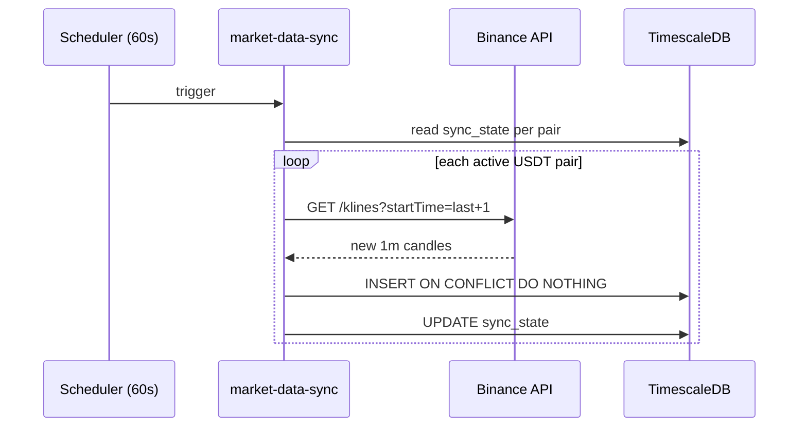

# MARKET DATA — ReboundLab

## Принципы

1. **Бэктестер НИКОГДА не обращается к API бирж** — только SELECT из БД
2. **Только официальные API** — Binance REST, Bybit REST
3. **Incremental sync** — после первой загрузки только новые свечи
4. **Deduplication** — `INSERT ON CONFLICT DO NOTHING`
5. **Новые биржи** — через интерфейс `IExchangeConnector`, без изменения бэктестера

## Архитектура



## Поддерживаемые биржи

| Биржа | MVP | API endpoint |
|-------|-----|--------------|
| Binance | ✅ | api.binance.com |
| Bybit | Phase 2 | api.bybit.com |

## Список монет

- Автоматически: все USDT perpetual/futures pairs
- Фильтр: `min_history_days >= 365`
- Обновление списка: каждые 6 часов
- Таблица: `trading_pairs`

## Таймфреймы

| TF | Использование | Sync частота |
|----|---------------|--------------|
| 1m | **Основа для входа по падению** | каждые 60 сек |
| 5m, 15m | Графики | каждые 5/15 мин |
| 1h, 4h | Графики, обзор | каждый час |
| 1d | Годовой обзор | раз в сутки |

## Первичная загрузка (backfill)

1. Получить список USDT-пар с Binance `exchangeInfo`
2. Для каждой пары: определить `history_from`
3. Chunked load: по 1000 свечей (лимит API)
4. Checkpoint в `load_checkpoints` — resume при сбое
5. Retry: 3 попытки, exponential backoff

## Обработка ошибок

| Ситуация | Действие |
|----------|----------|
| API timeout | Retry через 30s, 60s, 120s |
| Rate limit 429 | Backoff + reduce concurrency |
| Invalid candle | Skip + log to `sync_logs` |
| Gap in data | `backfill_gaps` job (daily) |

## Папки модуля

```
services/market-data/
├── api/           # Read-only REST (candles, symbols)
├── sync/          # Python sync worker
│   ├── loaders/
│   ├── schedulers/
│   └── validators/
packages/exchange-sdk/
├── interfaces/
├── binance/
└── bybit/
```

## API (read-only)

| Method | Path | Description |
|--------|------|-------------|
| GET | `/symbols` | Active USDT pairs |
| GET | `/candles` | `?pair=BTCUSDT&tf=1m&from=&to=` |
| GET | `/sync/status` | Last sync per exchange |
